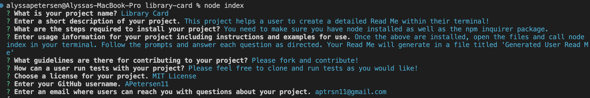
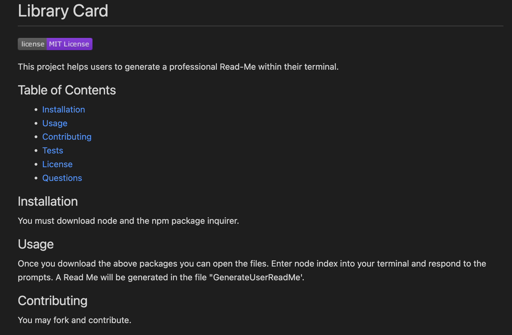
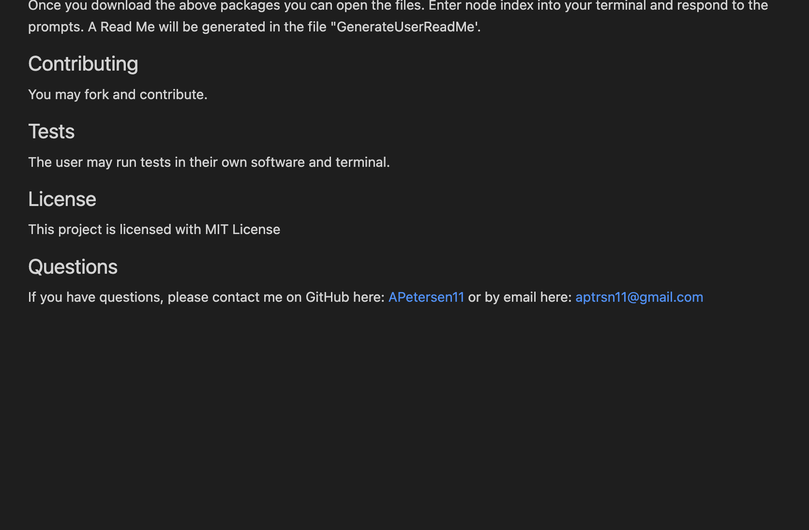

# Library Card

  
  

This project helps users to generate a professional Read-Me within their terminal.

## Table of Contents
- [Installation](#installation)
- [Usage](#usage)
- [Contributing](#contributing)
- [Tests](#tests)
- [License](#license)
- [Questions](#questions)

## Installation

You must download node and the npm package inquirer.

## Usage

Once you download the above packages you can open the files. Enter node index into your terminal and respond to the prompts. A Read Me will be generated in the file "GenerateUserReadMe'. Here is a link to the project walk-through: [walkthrough-link](https://drive.google.com/file/d/1JDfpzy0uW0bmvqbv9G3pzsIwfZd5iFU3/view)

## Contributing

You may fork and contribute.

## Tests

The user may run tests in their own software and terminal.

## License

This project is licensed with MIT License

## Questions

If you have questions, please contact me on GitHub here: [APetersen11](https://github.com/APetersen11)
or by email here: [aptrsn11@gmail.com](mailto:aptrsn11@gmail.com)

